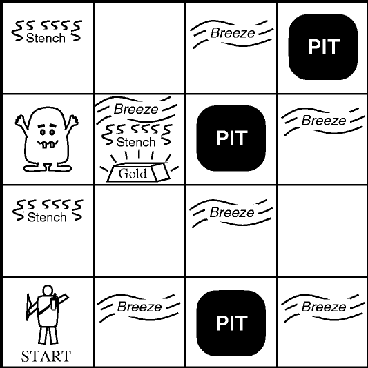

# Wumpus world.

This repository contains the implementation of the wumpus world from the book - "Artificial Intelligence: The modern Approach" by Peter Norvig, Stuart J. Russell.


## Introduction to Wumpus world.

Wumpus world is an imaginary problem in Artificial Intelligence where an Agent with a bow gets into a cave which is represented by
a 4x4 grid showed in the image below. In this cave lives a monster, named Wumpus, which is a monster
that the agent should avoid. Additionally, some cells in this cave has pits that the agent also should avoid
which are three in the cave. Finally one of the cells has the Gold, which is the main target of the agent.



Additionally, the cells around the wumpus have a stench, those around Pits have breeze and finally around Gold is glitter.

The agent has one arrow which he can use to kill the Wumpus, after killing the wumpus the agent can enter the cell of the wumpus.

Agent has the following possible actions:
- go up.
- go down.
- go left.
- go right.
- shoot up.
- shoot down.
- shoot left.
- shoot right.
- grab.

The agent should find the gold avoiding the Pits and the Wumpus.

## Implementation.

### Agent.
The agent is implemented by the `Agent` class from the `agent.py` file.

The agent isn't able to see the whole cave, it gets only the information from the cell in which it is as a json from the cave. This json is presented in the following code listing:
```json
{
  "breeze" : true,
  "stench" : true,
  "glitter" : false,
  "scream" : false,
  "bump" : true
}
```
Taking into account this values the agent is updating it's view of the cave. Then using this view it decides the next action.

### Cave.
The cave is implemented by `Cave` class from the `cave.py` file.

The `Cave` class generates randomly the cave and is taking actions from the agent. At every action taken it modifies the environment and returns the information from the new cell in which the agent moves.

## How the application works.

When the application is started a new environment is generated. At every step the agent is taking the information from cave. Then the agent takes his action, and these two actions are going on and on till the agent wins or dies.

## How to run the application.

First the machine on which it is runned should have Python 3 installed, and the following libraries installed:
- `Flask==1.1.4`

After having everything installed you should run the following command:
`python main.py`

Done by Păpăluță Vasile,\
contacts:\
E-mail : vpapaluta06@gmail.com\
[LinkedIn](https://www.linkedin.com/in/vasile-p%C4%83p%C4%83lu%C8%9B%C4%83/)


